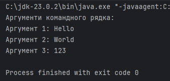

# Завдання №1: Робота з Git та консольною програмою

## Опис завдання

У рамках цього завдання потрібно виконати такі кроки:

1. **Підготувати сховище** для розміщення проекту.
2. **Створити консольну програму**, яка виводить аргументи командного рядка.
3. **Додати посилання на GIT** та архівований проект.

---

## Структура проєкту

```plaintext
├── src/                  # Вхідний код програми
│   ├── ex1/              # Пакет із кодом
│   │   ├── img           # Пакет зі скріншотами
│   │   ├── Main.java     # Головний файл програми
├── .gitignore            # Виключені файли
├── README.md             # Документація
```

## Скріншот виконання програми


## Посилання на файл

[Main.java](Main.java)

## Опис
Цей проєкт демонструє базову обробку аргументів командного рядка у Java через масив, що імітує вхідні дані.

## Що робить програма
- Створює масив рядків `predefinedArgs`, який містить три значення: `"Hello"`, `"World"`, `"123"`.
- Виводить заголовок: **Аргументи командного рядка:**
- За допомогою циклу `for` проходить по масиву та виводить кожен аргумент у форматі:

